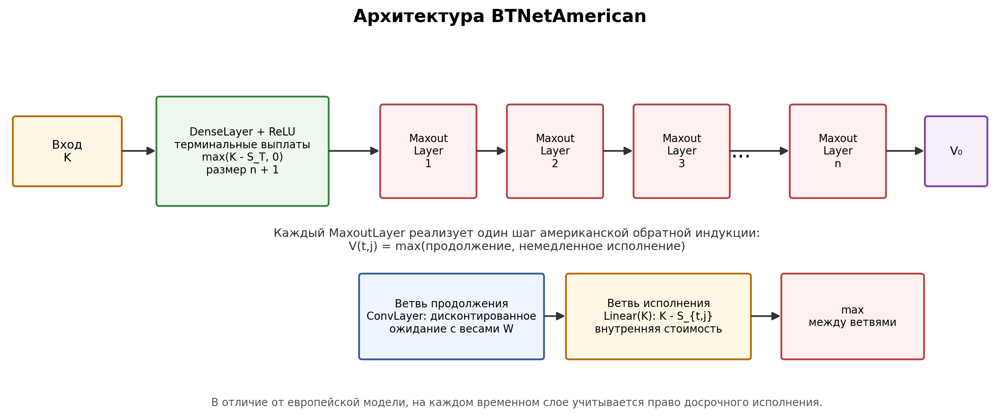
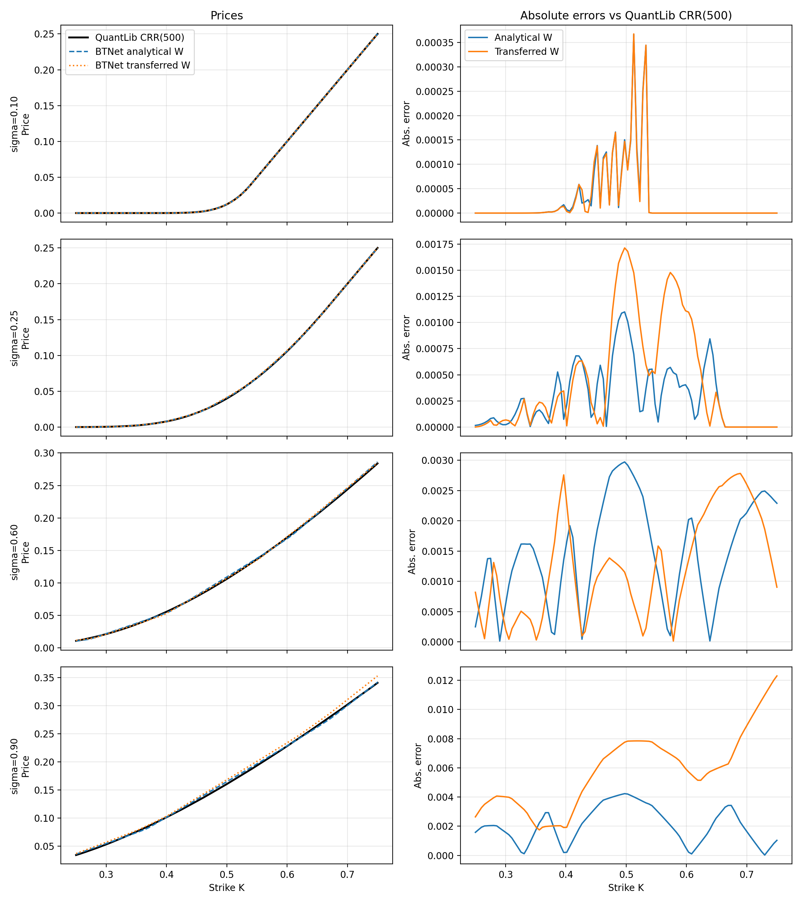

<!-- _class: title -->

# Оценка американских опционов нейронной сетью на основе биномиального дерева

Петров Артём Евгеньевич, НКНбд-01-22 
Научный руководитель: Шорохов С.Г. 
РУДН, 2026

---

## 1. Постановка задачи

- Объект исследования: **методы оценки опционов**
- Предмет исследования: **BTNet для американского пут-опциона и его чувствительностей**
- Американский пут допускает досрочное исполнение
- Поэтому задача оценки является задачей **оптимальной остановки**
- Для американского пута в общем случае нет простой аналитической формулы

В работе QuantLib CRR(500) используется как практический численный ориентир, а не как точное решение.

---

## 2. Цель и задачи

**Цель:** реализовать и численно верифицировать BTNet для оценки американских пут-опционов и анализа греческих символов через autograd.

1. Изучить Black-Scholes, CRR и нейросетевую эквивалентность BTNet
2. Реализовать `btnn_bs` на Python/PyTorch
3. Проверить прайсинг European / American put
4. Вычислить Delta, Gamma, Vega и Theta через autograd
5. Исследовать перенос весов `BTNetEuropean → BTNetAmerican`

---

## 3. Границы собственного вклада

**Не заявляется**

- новая теория BTNet
- новый метод оценки всех опционов
- замена CRR / QuantLib

**Сделано в ВКР**

- реализация `btnn_bs`
- верификация BTNetAmerican
- расчет греков через autograd
- эксперимент переноса весов
- выявление ограничения по Gamma

Теоретическая основа BTNet взята из работы Шорохова С. Г.

---

## 4. Почему BTNet

| Критерий | CRR | Обычная нейросеть | BTNet |
|---|---|---|---|
| Интерпретация весов | высокая | обычно низкая | высокая при CRR-инициализации |
| Раннее исполнение | естественно | требует обучения | `MaxoutLayer` |
| Autograd | не базовая форма | доступен | доступен |
| Основной риск | дискретизация | black box | кусочно-линейность, глубина `n` |

BTNet не отменяет CRR: она записывает его как интерпретируемую дифференцируемую сеть.

---

## 5. Нейросетевая запись CRR

| Элемент CRR | Элемент BTNet | Финансовый смысл |
|---|---|---|
| `max(K - S, 0)` | DenseLayer + ReLU | выплата в листьях дерева |
| дисконтированное ожидание | ConvLayer | шаг обратной индукции |
| `max(continuation, exercise)` | MaxoutLayer | раннее исполнение |
| корень дерева | выход сети | текущая цена |

Для американского опциона maxout является нейросетевой записью рекурсии Беллмана.

---

## 6. Архитектура BTNetAmerican

Каждый слой соответствует шагу обратной индукции, а maxout выбирает между продолжением и исполнением.

---

## 7. Методика верификации

**Базовый сценарий**

- `S0 = 0.5`
- `T = 1`
- `r = 0.05`
- `sigma = 0.25`
- `n = 9`
- `K ∈ [0.25; 0.75]`

**Что проверяется**

- European: Black-Scholes / QuantLib
- American: QuantLib CRR(500)
- метрики: MAE, RMSE, max|err|
- греки: autograd vs finite differences

---

## 8. Прайсинг American put

| Инициализация | MAE | RMSE | max\|err\| |
|---|---:|---:|---:|
| Analytical W | **2.84·10⁻⁴** | **4.06·10⁻⁴** | **1.10·10⁻³** |
| Transferred W | 4.38·10⁻⁴ | 6.81·10⁻⁴ | 1.71·10⁻³ |

---

## 9. Перенос весов: цена зависит от режима

| σ | Analytical W: MAE | Transferred W: MAE |
|---:|---:|---:|
| 0.10 | 2.66e-5 | 2.62e-5 |
| 0.25 | **2.84e-4** | 4.38e-4 |
| 0.60 | 1.47e-3 | **1.24e-3** |
| 0.90 | **2.06e-3** | 5.79e-3 |

Перенос может локально улучшить цену, но не является надежной процедурой инициализации.

---

## 10. Почему перенос весов нестабилен

| W | w0 | w1 | Сумма | Интерпретация |
|---|---:|---:|---:|---|
| CRR | 0.4847 | 0.5097 | 0.9944 | риск-нейтральное ожидание |
| Transfer | 0.4889 | 0.5063 | 0.9952 | подстроен под европейскую цену |
| Разность | +0.0042 | -0.0034 | +0.0008 | смещение continuation value |

- Для европейской задачи такой сдвиг может быть полезен
- Для американской задачи он меняет сравнение `continuation` и `exercise`
- Для Vega / Theta фиксированный перенесенный W теряет канал зависимости от параметров

---

## 11. Греческие символы: главный отрицательный результат

| Грек | MAE | max\|diff\| |
|---|---:|---:|
| Delta | 7.92·10⁻³ | 9.25·10⁻² |
| Gamma | **0** | **0** |
| Vega | 3.31·10⁻³ | 3.65·10⁻² |
| Theta | 4.13·10⁻⁴ | 4.57·10⁻³ |

Gamma = 0 почти всюду не является ошибкой кода: это следствие кусочно-линейных ReLU/maxout.

---

## 12. Выводы

1. Цель работы достигнута: BTNet реализована и верифицирована для American put
2. Аналитическая CRR-инициализация дает точность **MAE = 2.84·10⁻⁴**
3. Перенос весов European → American является нестабильной эвристикой
4. Текущая BTNet пригодна для воспроизводимого прайсинга и анализа отдельных чувствительностей
5. Для полноценного риск-менеджмента требуется модификация архитектуры из-за Gamma

**Перспективы:** гладкие max/ReLU, анализ глубины `n`, локальная волатильность, экзотические опционы.

