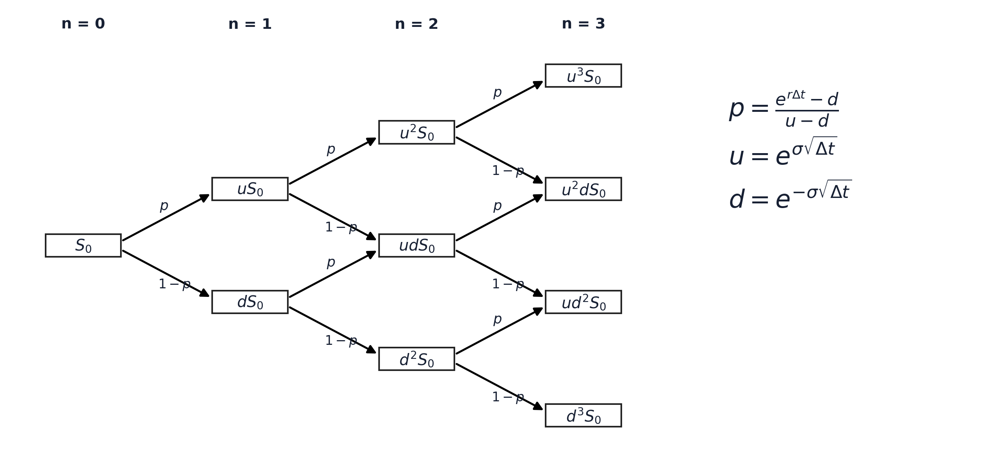
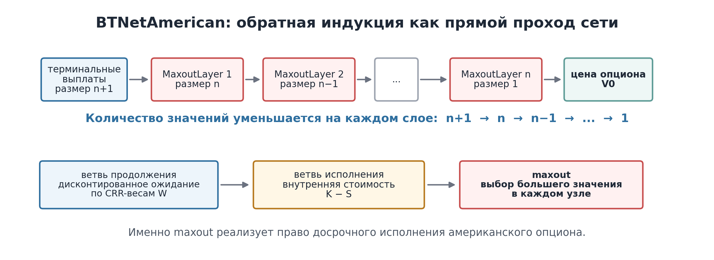
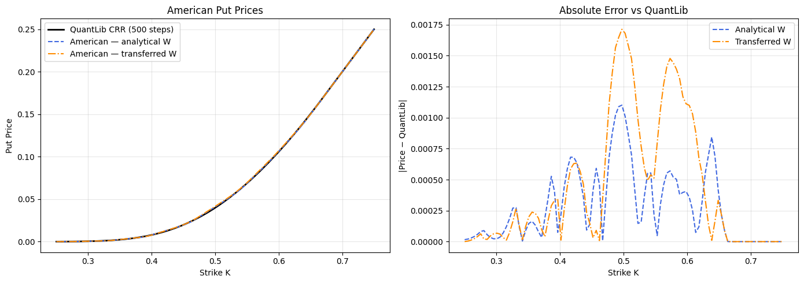

<!-- _class: title -->

# Оценка американских опционов нейронной сетью на основе биномиального дерева

Петров Артём Евгеньевич, НКНбд-01-22 
Научный руководитель: Шорохов С.Г. 
РУДН, 2026

---

## 1. Что такое американский опцион

- **Пут-опцион** дает право продать актив по заранее заданной цене `K`
- **Европейский** опцион исполняется только в дату экспирации
- **Американский** опцион можно исполнить в любой момент до экспирации
- Поэтому при оценке нужно выбирать:

продолжать держать опцион **или** исполнить его сейчас

Именно право досрочного исполнения делает американский пут задачей оптимальной остановки.

---

## 2. Почему оценка сложна

- Для европейского опциона есть аналитическая формула Black-Scholes
- Для американского пута простой замкнутой формулы в общем случае нет
- Цена зависит от будущей траектории базового актива и решения об исполнении
- На практике используют численные методы: CRR, конечные разности, Monte Carlo

**Задача ВКР:** реализовать модели архитектуры, основанной на биномиальном дереве метода CRR, обучить европейскую модель и проверить американскую модель.

---

<!-- _class: figure -->

## 3. Биномиальное дерево CRR

---

## 4. Формулы CRR для American put

Параметры дерева:

| Параметр | Формула |
|---|---|
| шаг времени | `dt = T / n` |
| рост | `u = exp(sigma * sqrt(dt))` |
| падение | `d = exp(-sigma * sqrt(dt))` |
| вероятность | `p = (exp(r dt) - d) / (u - d)` |

Рекурсия для американского пута:

`V(i,j) = max( K - S(i,j), exp(-r dt) * (p V_up + (1-p) V_down) )`

---

## 5. Что такое BTNet

**BTNet = Binomial Tree Neural Network.**

Это нейросетевая архитектура, прямой проход которой повторяет обратную индукцию CRR-дерева.

| CRR | BTNet |
|---|---|
| терминальная выплата `max(K-S,0)` | первый слой |
| дисконтированное ожидание | линейный фильтр `W` |
| шаги назад по дереву | последовательность слоев |
| досрочное исполнение | `maxout` |

Теоретическая основа BTNet взята из работы Шорохова С. Г.

---

## 6. Реализация в ВКР

**`btnn_bs`**

программный пакет на Python/PyTorch для воспроизводимых экспериментов

**`BTNetEuropean`**

модель для европейского пут-опциона

**`BTNetAmerican`**

модель для американского пут-опциона с maxout-слоями

**Greeks**

Delta, Gamma, Vega, Theta — чувствительности цены к рыночным параметрам

---

## 7. Ключевая особенность архитектуры

---

<!-- _class: evidence -->

## 8. Проверка точности цены

| Инициализация | MAE | RMSE | max\|err\| |
|---|---:|---:|---:|
| Analytical W | **2.84·10⁻⁴** | **4.06·10⁻⁴** | **1.10·10⁻³** |
| Transferred W | 4.38·10⁻⁴ | 6.81·10⁻⁴ | 1.71·10⁻³ |

Ориентир: QuantLib CRR(500), не точное аналитическое решение.

---

## 9. Важные результаты экспериментов

**Перенос весов**

- European → American не дает стабильного улучшения
- при `sigma = 0.90` ошибка заметно растет
- аналитическая CRR-инициализация надежнее

**Ограничение для рисков**

- чувствительности можно считать через autograd
- Gamma = 0 почти всюду
- причина: ReLU/maxout кусочно-линейны

Это ограничение важно для риск-менеджмента: для полноценного delta-gamma hedging архитектуру нужно сглаживать.

---

## 10. Что сделано и выводы

**В работе выполнено:**

1. Реализован пакет `btnn_bs` на Python/PyTorch
2. Построены модели `BTNetEuropean` и `BTNetAmerican`
3. Обучена европейская модель и проверена американская модель
4. Проведена верификация цены относительно Black-Scholes и QuantLib CRR(500)
5. Проведен эксперимент переноса весов European → American

**Основные выводы:** аналитическая CRR-инициализация дает точную и интерпретируемую цену, перенос весов нестабилен, а Gamma требует гладкой модификации архитектуры.

GitHub BTNet-BS

