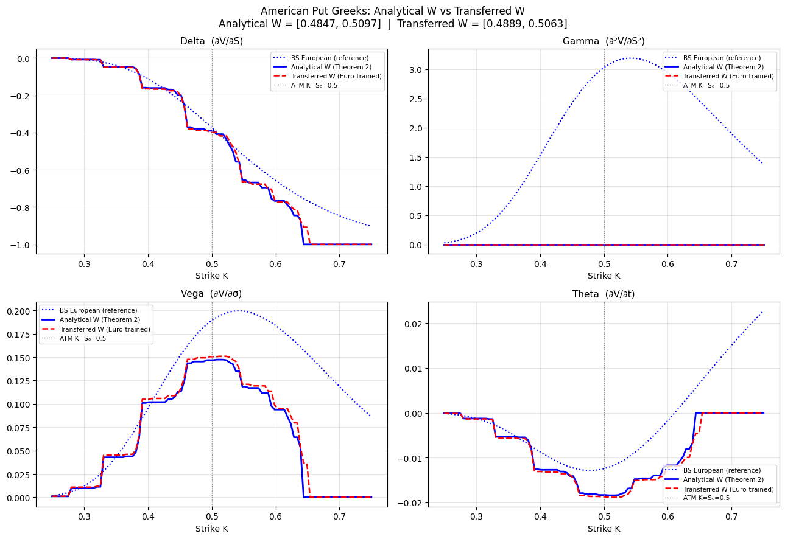
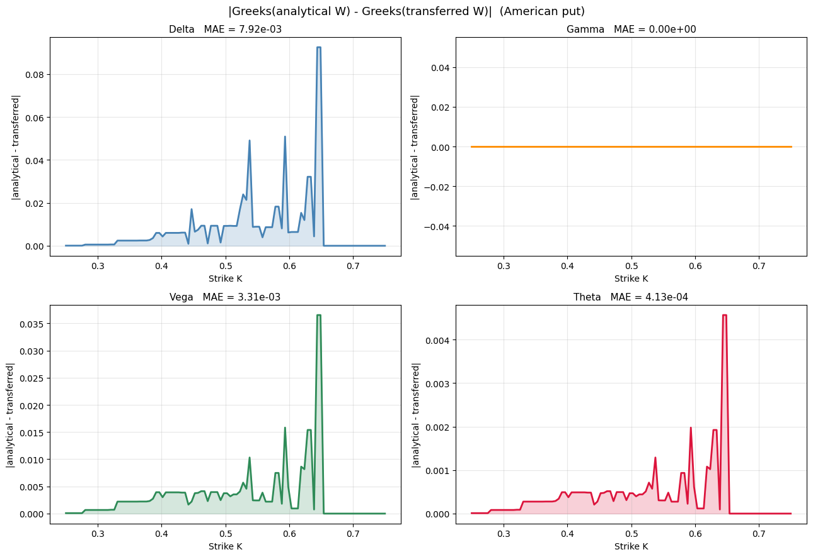

# Предзащита ВКР
## «Оценка американских опционов нейронной сетью на основе биномиального дерева»
Петров Артём Евгеньевич, НКНбд-01-22

---

## Слайд 1 — Цель и метод

**Цель:** реализовать и верифицировать нейросетевую архитектуру BTNet, прямой проход которой математически эквивалентен обратной индукции по биномиальному дереву CRR, и исследовать вычисление греческих символов опционов через автоматическое дифференцирование.

| | BTNetEuropean | BTNetAmerican |
|---|---|---|
| Слои | DenseLayer + *n* ConvLayer | DenseLayer + *n* MaxoutLayer |
| Активация | ReLU | maxout |
| Эквивалент | Прямая индукция CRR (европейский пут) | Обратная индукция с ранним исполнением |

**Параметры:** *n* = 9, *S*₀ = 0.5, *σ* = 0.25, *r* = 0.05, *T* = 1 · обучение — 200 страйков · тест — 100 точек

---

<!-- _class: medium -->

## Слайд 2 — Прайсинг: BTNet vs QuantLib

| Инициализация | MAE | RMSE | max\|err\| |
|---|---|---|---|
| Analytical W | **2.84·10⁻⁴** | 4.06·10⁻⁴ | 1.10·10⁻³ |
| Transferred W | 4.38·10⁻⁴ | 6.81·10⁻⁴ | 1.71·10⁻³ |

> Эталон — QuantLib BinomialVanillaEngine CRR (500 шагов). Аналитическая инициализация воспроизводит дерево той же глубины с MAE < 3·10⁻⁴.

---

<!-- _class: medium -->

## Слайд 3а — Греческие символы опционов

**Gamma = 0** — фундаментальный эффект: ReLU-сеть кусочно-линейна по *S*₀, поэтому *d*²*V*/*dS*₀² = 0 почти всюду.

---

<!-- _class: medium -->

## Слайд 3б — Влияние переноса весов на греческие символы

| Символ | MAE | max\|diff\| |
|---|---|---|
| Delta | 7.92·10⁻³ | 9.25·10⁻² |
| **Gamma** | **0** | **0** |
| Vega | 3.31·10⁻³ | 3.65·10⁻² |
| Theta | 4.13·10⁻⁴ | 4.57·10⁻³ |

Отклонение весового фильтра *ΔW* ≈ 0.004 → ошибка Delta MAE ≈ 8·10⁻³.

---

## Слайд 4 — Итог

**BTNet с аналитической инициализацией воспроизводит биномиальное дерево CRR с точностью MAE = 2.84·10⁻⁴ и допускает дифференцирование по рыночным параметрам — что открывает возможность вычисления греческих символов опционов без дополнительных численных схем.**