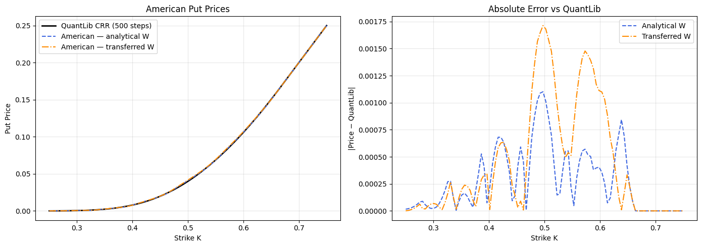

# Оценка американских опционов нейронной сетью на основе биномиального дерева

**Петров Артём Евгеньевич**, НКНбд-01-22

Научный руководитель: Шорохов С.Г.

РУДН, 2026

---

## Актуальность и цель

**Актуальность**

- Американский пут-опцион — задача оптимальной остановки с **подвижной краевой границей**
- Аналитического решения не существует → применяются численные методы (CRR, Monte Carlo)
- Нейросетевая архитектура открывает путь к греческим символам через **autograd**

**Цель**

Реализовать и верифицировать BTNet — нейросетевую архитектуру, прямой проход которой математически эквивалентен обратной индукции по биномиальному дереву CRR

---

## Задачи

1. Изучить теоретические основы биномиальной модели CRR и нейросетевой эквивалентности BTNet
2. Реализовать архитектуры **BTNetEuropean** и **BTNetAmerican** в PyTorch
3. Верифицировать точность прайсинга относительно эталона QuantLib CRR (500 шагов)
4. Вычислить греческие символы (Δ, Γ, ν, Θ) через `torch.autograd.grad`, исследовать их свойства
5. Провести эксперимент с переносом весов, оценить влияние на точность греческих символов

---

## Методы

| | BTNetEuropean | BTNetAmerican |
|---|---|---|
| Слои | DenseLayer + *n* ConvLayer | DenseLayer + *n* MaxoutLayer |
| Активация | ReLU | maxout |
| Эквивалент | Прямая индукция CRR | Обратная индукция с ранним исполнением |

**Параметры эксперимента:** *n* = 9, *S*₀ = 0.5, σ = 0.25, *r* = 0.05, *T* = 1

Аналитическая инициализация весов: *w* = [*p*·e^(−rΔt), *q*·e^(−rΔt)] из параметров CRR

---

## Результаты: прайсинг

| Инициализация | MAE | RMSE | max\|err\| |
|---|---|---|---|
| Analytical W | **2.84·10⁻⁴** | 4.06·10⁻⁴ | 1.10·10⁻³ |
| Transferred W | 4.38·10⁻⁴ | 6.81·10⁻⁴ | 1.71·10⁻³ |

---

## Выводы

- BTNet с аналитической инициализацией воспроизводит CRR с **MAE = 2.84·10⁻⁴**
- **Gamma = 0** повсюду: ReLU-сеть кусочно-линейна по *S*₀ → вторая производная тождественно равна нулю
- Отклонение весового фильтра Δ*W* ≈ 0.004 → **Delta MAE ≈ 8·10⁻³**, Vega MAE ≈ 3·10⁻³
- Autograd даёт Delta, Vega, Theta без дополнительных численных схем → применимо для оценки рыночного риска

---

## Направления развития

1. Замена ReLU на **гладкие активации** (Softplus, GELU) для получения ненулевой Gamma
2. Расширение архитектуры на **многомерные активы** и барьерные опционы
3. Обучение BTNet на **рыночных данных** для калибровки подразумеваемой волатильности
4. Применение вычисленных греческих символов для **дельта-хеджирования** реального портфеля
